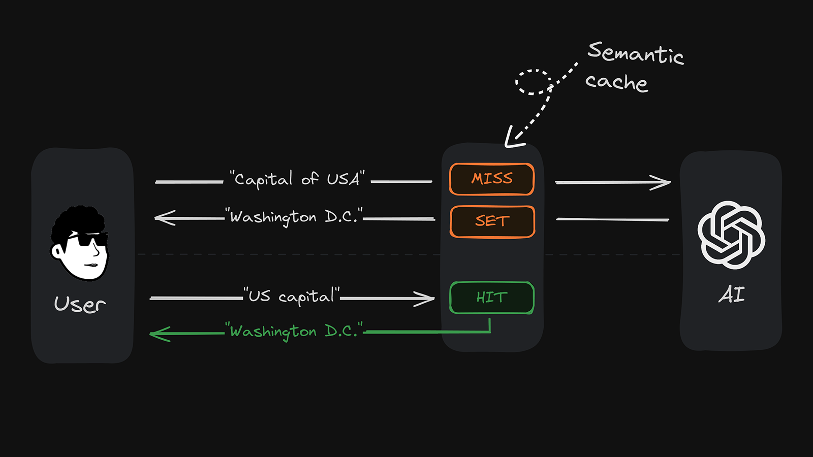

# Semantic Cache

> [!NOTE]  
> **This project is in the Experimental Stage.**
> 
> We declare this project experimental to set clear expectations for your usage. There could be known or unknown bugs, the API could evolve, or the project could be discontinued if it does not find community adoption. While we cannot provide professional support for experimental projects, we’d be happy to hear from you if you see value in this project!


Semantic Cache is a tool for caching natural text based on semantic similarity. It's ideal for any task that involves querying or retrieving information based on meaning, such as natural language classification or caching AI responses. Two pieces of text can be similar but not identical (e.g., "great places to check out in Spain" vs. "best places to visit in Spain"). Traditional caching doesn't recognize this semantic similarity and misses opportunities for reuse.

Semantic Cache allows you to:

- Easily classify natural text into predefined categories
- Avoid redundant LLM work by caching AI responses
- Reduce API latency by responding to similar queries with already cached values



## Highlights

- **Uses semantic similarity**: Stores cache entries by their meaning, not just the literal characters
- **Handles synonyms**: Recognizes and handles synonyms
- **Multi-language support**: Works across different languages (if configured with multilingual vector models)
- **Complex query support**: Understands long and nested user queries
- **Easy integration**: Simple API for usage in Node.js applications
- **Customizable**: Set a custom proximity threshold to filter out less relevant results

## Getting Started

### Prerequisites

- An Upstash Vector database (create one [here](https://console.upstash.com/vector))

### Installation

Install the package:

```bash
npm install @upstash/semantic-cache @upstash/vector
```

### Setup

First, create an Upstash Vector database [here](https://console.upstash.com/vector). You'll need the `url` and `token` credentials to connect your semantic cache. Important: Choose any pre-made embedding model when creating your database.

> [!NOTE]  
> Different embedding models are great for different use cases. For example, if low latency is a priority, choose a model with a smaller dimension size like `bge-small-en-v1.5`. If accuracy is important, choose a model with more dimensions.

Create a `.env` file in the root directory of your project and add your Upstash Vector URL and token:

```plaintext
UPSTASH_VECTOR_REST_URL=https://example.upstash.io
UPSTASH_VECTOR_REST_TOKEN=your_secret_token_here
```

### Using Semantic Cache

Here’s how you can use Semantic Cache in your Node.js application:

```typescript
import { SemanticCache } from "@upstash/semantic-cache";
import { Index } from "@upstash/vector";

// 👇 your vector database
const index = new Index();

// 👇 your semantic cache
const semanticCache = new SemanticCache({ index, minProximity: 0.95 });

async function runDemo() {
  await semanticCache.set("Capital of Turkey", "Ankara");
  await delay(1000);

  // 👇 outputs: "Ankara"
  const result = await semanticCache.get("What is Turkey's capital?");
  console.log(result);
}

function delay(ms: number) {
  return new Promise((resolve) => setTimeout(resolve, ms));
}

runDemo();
```

### The `minProximity` Parameter

The `minProximity` parameter ranges from `0` to `1`. It lets you define the minimum relevance score to determine a cache hit. The higher this number, the more similar your user input must be to the cached content to be a hit. In practice, a score of 0.95 indicates a very high similarity, while a score of 0.75 already indicates a low similarity. For example, a value of 1.00, the highest possible, would only accept an _exact_ match of your user query and cache content as a cache hit.

## Examples

The following examples demonstrate how you can utilize Semantic Cache in various use cases:

> [!NOTE]  
> We add a 1-second delay after setting the data to allow time for the vector index to update. This delay is necessary to ensure that the data is available for retrieval.

### Basic Semantic Retrieval

```typescript
await semanticCache.set("Capital of France", "Paris");
await delay(1000);

// 👇 outputs "Paris"
const result = await semanticCache.get("What's the capital of France?");
```

### Handling Synonyms

```typescript
await semanticCache.set("largest city in USA by population", "New York");
await delay(1000);

// 👇 outputs "New York"
const result = await semanticCache.get("which is the most populated city in the USA?");
```

### Multilingual Queries

Note: Your embedding model needs to support the languages you intend to use.

```typescript
await semanticCache.set("German Chancellor", "Olaf Scholz");
await delay(1000);

// 👇 "Who is the chancellor of Germany?" -> outputs "Olaf Scholz"
const result = await semanticCache.get("Wer ist der Bundeskanzler von Deutschland?");
```

### Complex Queries

```typescript
await semanticCache.set("year in which the Berlin wall fell", "1989");
await delay(1000);

// 👇 outputs "1989"
const result = await semanticCache.get("what's the year the Berlin wall destroyed?");
```

### Different Contexts

```typescript
await semanticCache.set("the chemical formula for water", "H2O");
await semanticCache.set("the healthiest drink on a hot day", "water");

await delay(1000);

// 👇 outputs "water"
const result = await semanticCache.get("what should i drink when it's hot outside?");

// 👇 outputs "H2O"
const result = await semanticCache.get("tell me water's chemical formula");
```

## Contributing

We appreciate your contributions! If you'd like to contribute to this project, please fork the repository, make your changes, and submit a pull request.

## License

Distributed under the MIT License. See `LICENSE` for more information.
